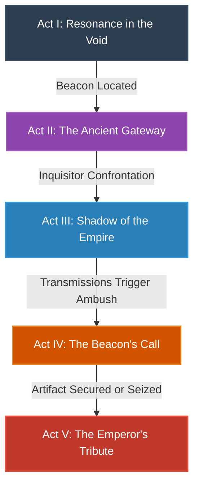

# Campaign Guide: Dungeon of the Stars — Shadows of Sworinta (Sith Beacon Mission)

This document outlines the overarching, branching campaign structure for the Dungeon of the Stars engine. It serves as a tactical narrative blueprint for the Game Master (LLM) and the player, incorporating persistent consequences, mutinies, structural hazards, and capital ship encounters.

---

## Campaign Overview
* **Flagship:** *The Broken Sunrise* (Imperial I-class Star Destroyer) - Operating alone, equipped with advanced prototype shields, a faster Class 1.5 hyperdrive, and overcharged turbolaser batteries.
* **Theater of Operations:** The Sworinta System, Deep Outer Rim (Gas giant Sworinta IV, radioactive moon belts, and the Deep Space Sector)
* **Core Conflict:** An ancient Sith beacon has begun transmitting a weak ping. The Commodore must investigate, locate, and retrieve any artifacts for the Emperor. However, an Imperial Inquisitor has been assigned to the ship to monitor the mission, creating internal tension and potential mutiny.

---

---

## Act I: Resonance in the Void
### "A single hunter following a phantom signal."
* **Primary Objective:** Track the weak ping of the ancient Sith beacon and guide *The Broken Sunrise* to its coordinates while masking the ship's presence in Sworinta IV's radioactive orbit.
* **Key Incidents:**
  * **The Silent Shadow:** Sensor sweeps detect the ping. The bridge crew logs it as an ancient distress call from a derelict warship. Local pirate scouts (Sworinta Reavers) are also tracking the signal under the same warship assumption. Only the Commodore and the Inquisitor know its true Sith nature.
  * **Inquisitor's Watch:** The assigned Inquisitor demands absolute secrecy regarding the true nature of the beacon, warning that any crew member who suspects or talks about Sith involvement must be immediately silenced or sent to the brig.
* **Tactical Choices:**
  * Do you jam the pirate scouts immediately (risking alerting their main fleet), or shadow them to find their staging area?
  * How do you direct the bridge crew to run scans and chart transit vectors without revealing the true nature of the destination to Commander Kross and the officers?

---

## Act II: The Ancient Gateway
### "Stepping into the dark."
* **Primary Objective:** Launch a shuttle boarding party to enter the ancient space station built into the beacon's core.
* **Key Incidents:**
  * **The Dead Station:** The boarding team encounters automated Sith sentry droids and decaying structural integrity.
  * **The Crypt Key:** Discovering the central archives requires slicing into an ancient databank, which triggers a security lockdown.
* **Tactical Choices:**
  * Send the Inquisitor to lead the boarding party (letting them take the risks but giving them direct access to artifacts), or lead the stormtrooper squads via remote command.
  * Attempt to disable the security grid safely (low speed, low risk) or blast through the station's sub-reactors (high speed, high structural damage).

---

## Act III: Shadow of the Empire
### "Trust is a luxury the Empire cannot afford."
* **Primary Objective:** Suppress internal dissent and resolve the Inquisitor's secret agenda aboard *The Broken Sunrise*.
* **Key Incidents:**
  * **Bridge Power Struggle:** The Inquisitor attempts to take direct command of the ship's navigation to jump coordinates undisclosed to the Emperor.
  * **The Whispering Crew:** Conspirators among the bridge crew, terrified of the Inquisitor, plot to sabotage the hyperdrive to escape.
* **Tactical Choices:**
  * Arrest the mutinous crew immediately, or use them as leverage/bait to expose the Inquisitor's treason.
  * Lock down the bridge and lock the Inquisitor in their quarters, or comply with their demands to see where the path leads.

---

## Act IV: The Beacon's Call
### "Drawn to the flame."
* **Primary Objective:** Defend the Sith beacon station and *The Broken Sunrise* from a hostile fleet drawn to the beacon's activated power signature.
* **Key Incidents:**
  * **The Ambush:** A local syndicate/pirate battlegroup exits hyperspace to seize the Sith artifacts.
  * **Overcharged Prototype:** The flagship's custom weapons and shields must be pushed to their limits to hold off multiple enemy vessels.
* **Tactical Choices:**
  * Use the ship's advanced Class 1.5 hyperdrive to make hit-and-run jumps, or stand your ground in a heavy turbolaser duel.
  * Direct the hangar bay fighters to defend the station's docking ring where the boarding team is retrieving the artifact.

---

## Act V: The Emperor's Tribute
### "The price of power."
* **Primary Objective:** Deliver the Sith artifacts to the Emperor or decide the fate of the newly discovered dark energy source.
* **Key Incidents:**
  * **The Emperor's Call:** A direct HoloNet channel from the Emperor demands the immediate transfer of the artifact.
  * **Final Betrayal:** The Inquisitor makes a final move to seize the artifact and eliminate the Commodore.
* **Tactical Choices:**
  * Kill the Inquisitor and present their head along with the artifact to the Emperor, proving your loyalty.
  * Keep the artifact's power for yourself, using the upgraded systems of *The Broken Sunrise* to declare independence in the Deep Outer Rim.

---

## Game Master (LLM) Pacing Rules
1. **Never Let Tension Reset:** If a subsystem is damaged or the Inquisitor's suspicion is raised, carry the consequences over directly to subsequent turns.
2. **Single Ship Isolation:** Emphasize that *The Broken Sunrise* is operating completely alone, far from Imperial reinforcements. Every lost stormtrooper or damaged hull section cannot be easily replaced.
3. **The Inquisitor's Presence:** The Inquisitor should act as an active, ominous presence in dialogue, offering dark side guidance or threatening reporting of the Commodore's actions.
